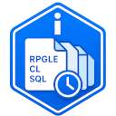
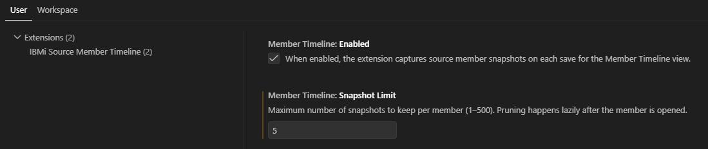
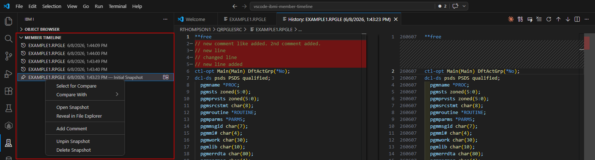
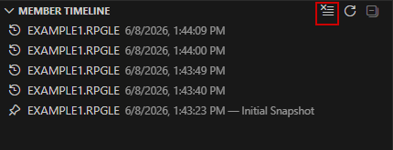
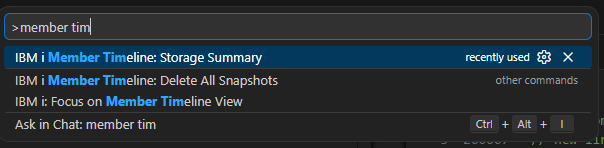

<p>
  
</p>

# IBM i Source Member Timeline

A Visual Studio Code extension that automatically captures and shows the save history of IBM i source members. Every time you open or save a source member, a snapshot is stored locally on your PC — giving you a fast, lightweight history you can browse, diff, and manage without touching source control and without any round trips to the IBM i.

Requires the [Code for IBM i](https://marketplace.visualstudio.com/items?itemName=HalcyonTechLtd.code-for-ibmi) extension.

---

## Features

- **Automatic snapshots on open** — a baseline snapshot is captured when a member is opened for editing (browse-mode opens are skipped; if the content matches the last snapshot, no duplicate is created)
- **Automatic snapshots on save** — a snapshot is captured each time you save a source member
- **Change detection** — if the content hasn't changed since the last snapshot, no new snapshot is created
- **Blank members are skipped** — newly created, empty source members do not get a snapshot until they contain content
- **Initial Snapshot pinned automatically** — the very first snapshot for a member is pinned and labelled "Initial Snapshot" so you always have a restore point; pinned snapshots are never pruned automatically
- **Timeline view** — browse all snapshots for the active member in the IBM i Explorer panel
- **Recently Opened Members panel** — a companion view that lists the last members you opened (most recent first, scoped to the connected system); click an entry to reopen it directly from the IBM i — no local copy is downloaded or cached by this extension
- **Toggle the Recently Opened Members panel** — disable it to hide the panel and stop tracking; previously recorded history is kept and picks back up if you re-enable it
- **Diff against current** — click any snapshot to open a side-by-side diff against the current source
- **Compare With** — right-click any snapshot to compare it against the active file, another snapshot, a local file, an IFS file, or another member
- **Snapshot comments** — right-click any snapshot to add or edit an optional note (e.g. "Before refactor", "Working version")
- **Pin snapshots** — right-click any snapshot to pin it; pinned snapshots are exempt from automatic pruning and survive Clear Member History
- **Open snapshot** — right-click to open a snapshot as a read-only file in a new editor tab
- **Reveal in File Explorer** — right-click to open the snapshot location in Windows Explorer, macOS Finder, or your Linux file manager
- **Delete snapshots** — right-click one or more snapshots to permanently remove them; supports multi-select
- **Clear member history** — one-click button in the view title bar to remove all unpinned snapshots for the active member; pinned snapshots are preserved
- **Configurable limit** — control how many unpinned snapshots are kept per member; older ones are pruned automatically (pinned snapshots are never pruned)
- **Configurable recent members list** — control how many recently opened members are remembered per system
- **System-aware storage** — snapshots are scoped to the IBM i system you are connected to, so identically named members on different systems are tracked independently
- **Stored locally** — all snapshots are saved on your local PC, not the IFS
- **No IBM i server calls** — all content is read from VS Code's in-memory document model; no round trips to the IBM i are made

---

## Requirements

- [Code for IBM i](https://marketplace.visualstudio.com/items?itemName=HalcyonTechLtd.code-for-ibmi) must be installed and connected to an IBM i system

---

## How It Works

When you open a member for editing or save a source member (via the `member://` scheme used by Code for IBM i), the extension:

1. Identifies the connected IBM i system (by hostname) so snapshots are scoped per system
2. Checks whether the member was opened in browse (read-only) mode — if so, no snapshot is taken
3. Reads the document content already in memory — no IBM i download required
4. Hashes the content and compares it to the last saved snapshot
5. If the content has changed, writes a new snapshot file to local storage and updates the index

Snapshots are stored in VS Code's local extension storage on your PC:

| OS | Path |
|---|---|
| Windows | `%APPDATA%\Code\User\globalStorage\thomprl.ibmi-member-timeline\` |
| macOS | `~/Library/Application Support/Code/User/globalStorage/thomprl.ibmi-member-timeline/` |
| Linux | `~/.config/Code/User/globalStorage/thomprl.ibmi-member-timeline/` |

The folder structure within that location:

```
thomprl.ibmi-member-timeline/
  index.json           ← tracks all snapshot metadata (timestamps, comments, file paths)
  recentMembers.json   ← tracks the most recently opened members, per system
  snapshots/
    <member>_<timestamp>.<ext>
    ...
```

The Recently Opened Members panel only stores lightweight metadata (system, library, file, member name, and timestamp) in `recentMembers.json` — it never writes the member's source content to disk. Selecting an entry opens the member directly through the `member://` scheme, which Code for IBM i resolves against the live IBM i connection; this extension does not cache or persist that content.

---

## Extension Settings

| Setting | Default | Description |
|---|---|---|
| `memberTimeline.enabled` | `true` | Enable or disable snapshot capture on open and save |
| `memberTimeline.snapshotLimit` | `20` | Maximum snapshots to keep per member (1–500); older ones are pruned automatically as soon as a new snapshot is captured, and lazily for other members when they're opened |
| `memberTimeline.recentMembersEnabled` | `true` | Show the Recently Opened Members panel and track members as they're opened; disabling hides the panel and stops tracking, but keeps existing history (picks back up if re-enabled) |
| `memberTimeline.recentMembersLimit` | `10` | Number of recently opened members to remember in the Recently Opened Members panel (1–100), scoped per IBM i system |

<p>
  
</p>


---

## Usage

1. Connect to an IBM i system using Code for IBM i
2. Open a source member — the **Source Member Timeline** view appears in the IBM i Explorer panel and a baseline snapshot is captured automatically; the member is also added to the **Recently Opened Members** panel
3. Save the member to capture additional snapshots
4. **Click** any timeline entry to open a side-by-side diff against the current source
5. **Click** any entry in **Recently Opened Members** to reopen that member directly from the IBM i

<p>
  
</p>


### Timeline Options

| Action | Description |
|---|---|
| **Click / Diff icon** | Opens a side-by-side diff of the snapshot vs. the current source on IBM i |
| **Right-Click → Add Comment** | Adds or edits an optional note on the snapshot; the note is shown in the timeline description and diff title |
| **Right-Click → Pin Snapshot** | Pins the snapshot so it is never pruned automatically and survives Clear Member History; the entry icon changes to a pin |
| **Right-Click → Unpin Snapshot** | Removes the pin from a previously pinned snapshot |
| **Right-Click → Select for Compare** | Marks this snapshot as the left side for a future comparison (shown in a status bar message); the entry icon is unchanged |
| **Right-Click → Compare With → Active File** | Diffs the snapshot against whatever file is currently open in the editor |
| **Right-Click → Compare With → Selected** | Diffs against the snapshot previously marked with "Select for Compare" (only shown once a selection exists) |
| **Right-Click → Compare With → Local File** | Opens a file picker to choose any local file to diff against |
| **Right-Click → Compare With → IFS File** | Prompts for an IFS path and diffs against that file (requires an active IBM i connection) |
| **Right-Click → Compare With → Member** | Prompts for a member path (`LIBRARY/FILE/NAME.EXT`) and diffs against that member |
| **Right-Click → Open Snapshot** | Opens the snapshot as a read-only file in a new editor tab |
| **Right-Click → Reveal in File Explorer** | Opens the snapshot location in Windows Explorer / macOS Finder / Linux file manager |
| **Right-Click → Delete Snapshot(s)** | Deletes the selected snapshot(s), including pinned ones. Supports multi-select — hold Ctrl or Shift to select multiple entries before right-clicking |
| **Clear icon (view title bar)** | Removes all unpinned snapshots for the active member (with confirmation); pinned snapshots are preserved |

<p>
  
</p>


### Recently Opened Members Panel

A separate panel below the Source Member Timeline view lists the most recently opened members for the connected system, newest first.

| Action | Description |
|---|---|
| **Click** | Opens the member directly from the IBM i using the `member://` scheme — no local copy is downloaded or cached by this extension |
| **Clear icon (view title bar)** | Removes all entries from the Recently Opened Members panel for the connected system |

Entries are recorded when a member is actually opened as an editor tab (including browse/read-only opens), independent of snapshot capture, and are capped at `memberTimeline.recentMembersLimit` per system. Members that Code for IBM i or a language server (e.g. the RPGLE `/COPY`/`/INCLUDE` resolver) reads in the background without opening a visible tab are not recorded.

Set `memberTimeline.recentMembersEnabled` to `false` to hide the panel and stop tracking entirely; the recorded history is left in place on disk and the panel picks back up (starting from that stale list) if you turn it back on. History is not cleared automatically when you disable it — use the Clear icon first if you want a fresh start.

### Command Palette

| Command | Description |
|---|---|
| `IBM i Source Member Timeline: Storage Summary` | Shows total snapshot count, member count, and disk space used |
| `IBM i Source Member Timeline: Delete All Snapshots` | Permanently removes all snapshots for all members (with confirmation) |

<p>
  
</p>

---

## API Usage

### Code for IBM i Extension

This extension depends on [Code for IBM i](https://marketplace.visualstudio.com/items?itemName=HalcyonTechLtd.code-for-ibmi) for:

| API | Purpose |
|---|---|
| `instance.getConnection()` | Reads the current hostname to scope snapshots per IBM i system (metadata only — no server calls) |
| `instance.subscribe('connected', ...)` | Refreshes the timeline view and sets the current system when an IBM i connection is established |
| `instance.subscribe('disconnected', ...)` | Clears the timeline view and resets the current system when the connection is dropped |
| `member://` URI scheme | Identifies IBM i source member documents; the extension parses these URIs but makes no calls to the IBM i server |

No IBM i server calls are made by this extension. All snapshot content is read from VS Code's in-memory document model.

### VS Code APIs

| API | Purpose |
|---|---|
| `vscode.workspace.fs` | Local file I/O — reading and writing snapshot files and the index |
| `vscode.workspace.onDidOpenTextDocument` | Captures a baseline snapshot when a member is first opened |
| `vscode.workspace.onDidSaveTextDocument` | Captures a snapshot when a member is saved |
| `vscode.workspace.onDidChangeConfiguration` | Responds to changes in extension settings |
| `vscode.window.createTreeView` | Source Member Timeline and Recently Opened Members panels in the IBM i Explorer sidebar |
| `vscode.commands.executeCommand('vscode.diff', ...)` | Opens the side-by-side diff editor |
| `vscode.commands.executeCommand('vscode.open', ...)` | Opens a snapshot file, or a member from the Recently Opened Members panel, in a new editor tab |
| `vscode.commands.executeCommand('revealFileInOS', ...)` | Reveals the snapshot file in Windows Explorer / macOS Finder |
| `vscode.commands.executeCommand('setContext', ...)` | Sets context keys used by `when` clauses in menus |
| `vscode.window.showInputBox` | Comment input and member path prompts |
| `vscode.window.showOpenDialog` | Local file picker for Compare with Local File |
| `vscode.window.setStatusBarMessage` | Brief notification when a snapshot is selected for compare |
| `context.globalStorageUri` | Resolves the extension-scoped local storage path |

---

## License

[GNU General Public License v3.0](LICENSE)
